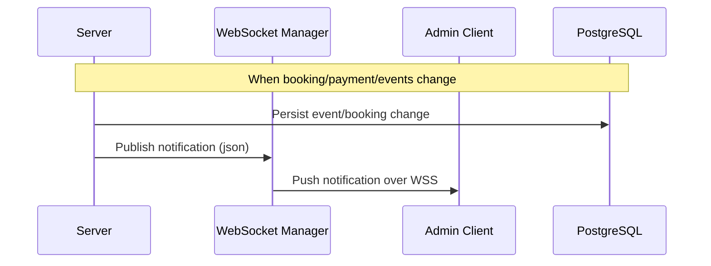
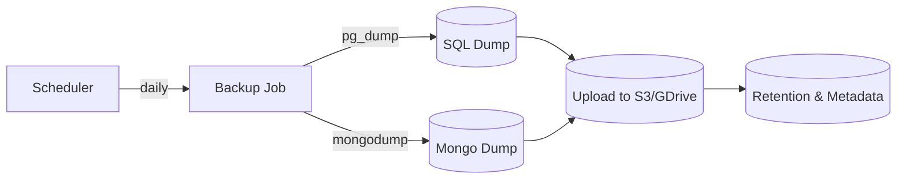

# System Architecture Document
Musical Event Management System (EMS)

Version: 1.0
Last Updated: 15 November 2025

---

## 1. Executive Summary

This document describes the high-level architecture, core components, data flows, and deployment considerations for the Musical Event Management System (EMS). EMS is a FastAPI-based backend that supports event creation and management, ticketing and bookings, facility management, content management (CMS), payments, reporting, and real-time admin notifications. The architecture emphasizes clear separation between API/router layers, business logic/services, data access, and asynchronous components such as WebSockets and background tasks.

### 1.1 Purpose
- Provide a single-source backend for event lifecycle management (create, update, cancel, reschedule).
- Support audience booking and payment flows (ticket selection, payment, PDF tickets/invoices).
- Manage facilities (venues, bands, decorations, snacks) and associated availability checks.
- Offer admin content management capability backed by MongoDB for rich content sections.
- Deliver operational capabilities: reporting, backups, dashboard analytics, and WebSocket-based notifications.

### 1.2 Key Features
- JWT-based authentication with role-based authorization (Admin, Organizer, Audience).
- Event and booking management with ticketing support.
- Facility booking and availability checks.
- File uploads for banners, profile images, content assets.
- Content Management System (hero, carousel, bands, FAQ, about, footer) backed by MongoDB.
- Asynchronous background jobs (scheduler) for recurring tasks and backups.
- Real-time notifications via WebSockets for admin clients.
- Reporting and dashboard endpoints for administrators.

---

## 2. Technology Stack

| Layer | Technology | Purpose |
|-------|-----------|---------|
| Backend Framework | FastAPI | REST API, WebSocket endpoints, async execution |
| ASGI Server | Uvicorn | Run the FastAPI app |
| Python Packages | Pydantic, Motor, SQLAlchemy, python-jose, passlib | Validation, Mongo driver, ORM, JWT, password hashing |
| Primary Databases | PostgreSQL (or other SQL) + MongoDB | Relational data (users, events, bookings) and document content (CMS/TNC) |
| ORM / DB Driver | SQLAlchemy (sync/async where used), Motor (async Mongo client) | DB access abstractions |
| Authentication | JWT (python-jose), role decorators | Token issuance, verification, role checks |
| Background / Scheduler | APScheduler / FastAPI lifespan-managed scheduler | Periodic tasks, backup triggers, cleanup jobs |
| Real-time | FastAPI WebSockets | Admin notifications and live events |
| File Storage | Local filesystem (`uploads/`) (S3 or Azure Blob for production) | Images, PDFs, banners, tickets |
| PDF Generation | ReportLab / WeasyPrint or wkhtmltopdf | Ticket/invoice PDF generation |


---

## 3. High-Level Architecture


┌─────────────────────────────────────────────────────────────┐
│                        Client Layer                         │
│    (Web Browser, Admin Dashboard, User Portal, Mobile)      │
└────────────────────────┬────────────────────────────────────┘
                         │ HTTPS/REST + WebSocket (wss://)
                         │
                         │
┌────────────────────────▼────────────────────────────────────┐
│                   FastAPI Application                       │
│  ┌───────────────────────────────────────────────────────┐  │  
│  │              Middleware Stack                         │  │
│  │  -  CORS Middleware (Cross-Origin Requests)           │  │
│  │  -  Trusted Host Middleware (Security)                │  │
│  │  -  Logging Middleware                                │  │
│  │  -  JWT Authentication dependency                     │  │
│  └──────────────────────┬────────────────────────────────┘  │
│                         │                                   │
│  ┌──────────────────────▼───────────────────────────────┐   │
│  │              API Router Layer (v1)                   │   │
│  │  /auth           -  Login, Register, Refresh         │   │
│  │  /user           -  User CRUD, Profile, Password     │   │
│  │  /events         -  Event CRUD, Reschedule, Cancel   │   │
│  │  /bookings       -  Book, Ticket, History            │   │
│  │  /facilities     -  Venue, Bands, Snacks, Decor      │   │
│  │  /payments       -  Payment Processing               │   │
│  │  /content        -  CMS (hero, carousel, bands, FAQ) │   │  
│  │  /dashboard      -  Analytics, Reporting             │   │
│  │  /backup         -  Backup & Restore                 │   │  
│  │  /ws             -  WebSocket Notifications          │   │ 
│  └──────────────────────┬───────────────────────────────┘   │
│                         │                                   │
│  ┌──────────────────────▼───────────────────────────────┐   │
│  │            Business Logic Layer                      │   │
│  │  -  Event & Booking Orchestration                    │   │
│  │  -  Payment & Ticket Generation                      │   │
│  │  -  Facility Availability & Selection                │   │
│  │  -  CMS Content Management                           │   │
│  │  -  Analytics & Reporting                            │   │
│  │  -  Backup & Restore Operations                      │   │
│  └──────────────────────┬───────────────────────────────┘   │
│                         │                                   │
│  ┌──────────────────────▼───────────────────────────────┐   │
│  │          Data Access Layer                           │   │
│  │  -  SQLAlchemy ORM Models (User, Event, Booking,     │   │ 
│  │     Payment, Facility, Ticket, Role)                 │   │
│  │  -  Motor/MongoDB Collections (CMS, TNC, Content)    │   │
│  └──────────────────────┬───────────────────────────────┘   │
└─────────────────────────┼───────────────────────────────────┘
                          │
                ┌─────────┴─────────┐
                │                   │
      ┌─────────▼────────┐  ┌──────▼──────────────┐
      │   PostgreSQL     │  │   MongoDB           │
      │  (Primary DB)    │  │  (CMS, TNC, Content)│
      │  -  Users        │  │  -  Hero, Carousel  │
      │  -  Events       │  │  -  Bands, FAQ      │
      │  -  Bookings     │  │  -  About, Footer   │
      │  -  Payments     │  └─────────────────────┘
      │  -  Facilities   │
      │  -  Tickets      │
      │  -  Roles        │
      └──────────────────┘
                │
      ┌─────────▼─────────────┐
      │   /uploads/ Storage   │
      │  (Images, PDFs, etc.) │
      └───────────────────────┘

---

## 4. Core Data Flows

### 4.1 User Registration & Login
- Client → POST `/register` (UserCreate schema)
- App validates with Pydantic, checks email uniqueness in SQL DB
- Hash password with secure algorithm, create user record
- Issue JWT access token and return to client

### 4.2 Event Creation (Organizer)
- Organizer → POST `/events/create_new_event` (EventBase schema)
- Validate fields and ticket rules (if `ticket_enabled`) in service layer
- Persist event and computed ticket inventory to SQL DB
- If images/banners provided, save to storage and record path

### 4.3 Booking & Payment Flow
- Audience → GET `/bookings/available/{event_id}` (ticket availability)
- Audience → POST `/bookings/book_event` (BookingCreate schema)
  - Reserve / decrement available ticket counts in a transactional manner
  - Create booking record; compute total price
  - Initiate payment; store payment metadata
  - Send ticket PDF or link to user (email or download endpoint)

### 4.4 Facility Availability Checks
- Organizer → GET `/facilities/facility/` with `id`, `date`, `slot`
- Query booked facility events between date ranges from SQL DB
- Return boolean availability and possible alternative dates

### 4.5 Content Management (CMS)
- Admin → POST / PUT `/content/*` endpoints
- Content stored in MongoDB collections (hero, venue-carousel, bands, faq, about-us, footer)
- File uploads for content saved to storage; content document stores image paths

### 4.6 WebSocket Notifications
- Server-side events (booking created, payment succeeded, event cancelled) are pushed to WebSocket manager
- Admin clients connect to `/ws/admin` and receive JSON notifications

### 4.7 Backup & Restore
- Scheduled background job triggers DB dump for SQL DB (pg_dump) and backup of critical data
- Upload backups to configured external storage (S3/GDrive) and store metadata in backups table
- Restore supported via admin endpoint which validates backup integrity before restore

---

## 5. Middleware & Cross-Cutting Concerns

- CORS middleware: configured allowed origins for frontend/admin domains
- Authentication dependency: JWT verification applied to protected routes
- Role-based access control: `role_requires()` decorator or dependency for admin/organizer-only routes
- Request validation: Pydantic schemas for all inbound requests
- Upload handling: limit file size, validate MIME types, store with unique filenames
- Error handling: standardized error responses, exceptions mapped to HTTP status codes
- Logging & audit: structured request/response and error logging; important admin actions are auditable

---

## 6. Security Considerations

- Use strong JWT signing keys and rotate periodically (`SECRET_KEY`, `ALGORITHM` from config)
- Store sensitive config in environment variables or a secrets manager (DB credentials, payment keys)
- Validate and sanitize all file uploads; scan for malware where applicable
- Enforce rate limits on public endpoints (login, booking) to mitigate abuse
- Use HTTPS in production and enforce secure cookie flags if cookies are used
- Apply least-privilege permissions for DB users and storage credentials
- Protect admin WebSocket endpoints with JWT + role checks

---

## 7. Scalability & Performance

- Horizontal scaling of FastAPI workers behind a load balancer (multiple Uvicorn workers, or container instances)
- Move static assets and uploaded files to object storage (S3/Blob) and serve via CDN
- Use connection pooling for SQL DB and reuse Motor client for MongoDB
- Cache frequently read content (hero, venue carousel) in-memory (Redis) to reduce DB load
- Offload heavy or long-running tasks (PDF generation, large backups) to background workers or async tasks

---

## 8. Observability

- Application logging (structured JSON) and centralized log ingestion (ELK, Azure Monitor)
- Distributed tracing for request flows (optional OpenTelemetry)
- Metrics (Prometheus) for request rates, latency, error rates, job success/failure
- Health check endpoints for readiness and liveness

---
Minimal run commands (development):
```bash
source ./EMS/Scripts/activate
uvicorn main:application --reload --port 8000
```

---

## 10. Backup & Disaster Recovery

- Schedule daily DB dumps for SQL and periodic snapshots for MongoDB; retain backups for a configurable retention window.
- Upload backups to remote storage (GDrive) and verify checksums after upload.
- Document and test restore procedures regularly in a staging environment.

---

## 11. Contact & Support

**Primary Developer:** Project owner / repository maintainer
**Support:** Open an issue in the repository or email the responsible engineering contact (as appropriate).

---

This architecture document is a living artifact and should be updated as the EMS grows or when major implementation decisions change.

## 12. Diagrams

Below are several diagrams (Mermaid) that illustrate core flows and interactions. You can paste these blocks into any Markdown renderer that supports Mermaid, or use an online Mermaid live editor to render PNG/SVG exports.

**High-Level Component Flow**

```mermaid
flowchart TD
  Client[Clients (Web / Mobile / Admin)] -->|HTTPS / WSS| API[FastAPI App]
  API -->|SQL| Postgres[(PostgreSQL)]
  API -->|Mongo| Mongo[(MongoDB)]
  API -->|Uploads| Storage[(S3 / Local Storage)]
  API -->|Background Jobs| Scheduler[(Background Scheduler)]
  API -->|WebSocket| AdminWS[WebSocket Manager]
  AdminWS --> AdminClient[Admin Dashboard]

```

**Booking → Payment Sequence**

```mermaid
sequenceDiagram
  participant C as Client
  participant A as API (FastAPI)
  participant P as Payment Gateway
  participant DB as PostgreSQL
  C->>A: POST /bookings/book_event (BookingCreate)
  A->>DB: Reserve tickets (transaction)
  A->>P: Create payment intent / redirect
  P-->>A: Payment status (webhook)
  A->>DB: Mark booking as paid; generate PDF ticket
  A->>C: 200 OK + download link / ticket
```

**WebSocket Notification Flow (Admin)**



**Backup & Restore Flow**




```

**Console Example: Book Event (curl)**

Use this `curl` example to create a booking (replace placeholders with real values):

```bash
curl -X POST "https://api.example.com/bookings/book_event" \
  -H "Authorization: Bearer <ACCESS_TOKEN>" \
  -H "Content-Type: application/json" \
  -d '{
    "event_id": "EVENT_ID_HERE",
    "tickets": [{"type": "general", "quantity": 2}],
    "payment_method": "card",
  }'
```